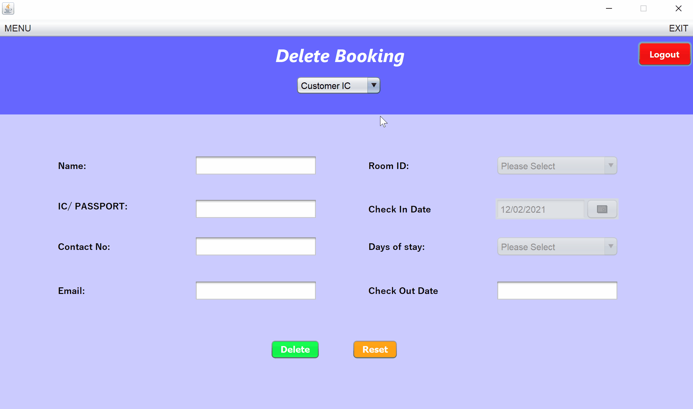
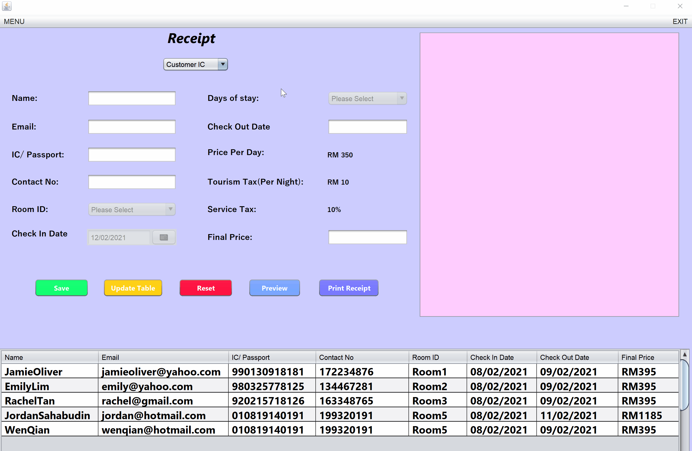

# hotelmanagementsystem
It is a system where staff can create, read, update, edit and delete booking for customers. 

## Getting Started
1. Install Apache Netbeans IDE 12. 
2. Import the downloaded hotel management system zip file through the File Tab of Apache Netbeans IDE.
3. Run the JAVA Main Class. 

## Demos and Screenshot 

-----

  <h2>Login Page</h2>

-----

  <h2>Home Page</h2>

-----

  <h2>Create Booking</h2>

-----

  <h2>View & Search Booking</h2>

-----

  <h2>Edit Booking</h2>

-----

  <h2>Delete Booking</h2>

-----

  <h2>Receipt Page</h2>

